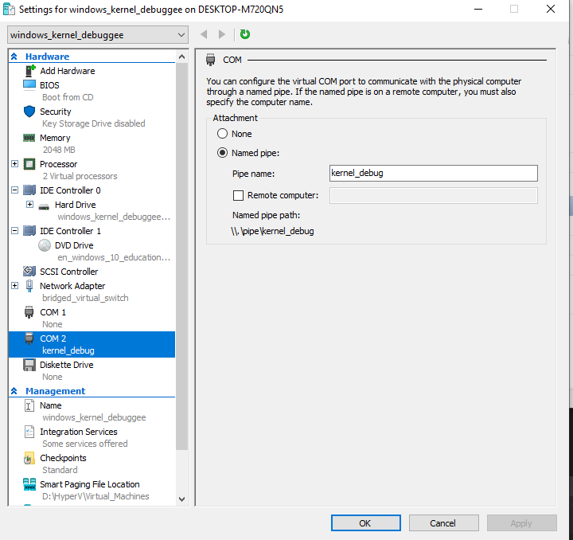
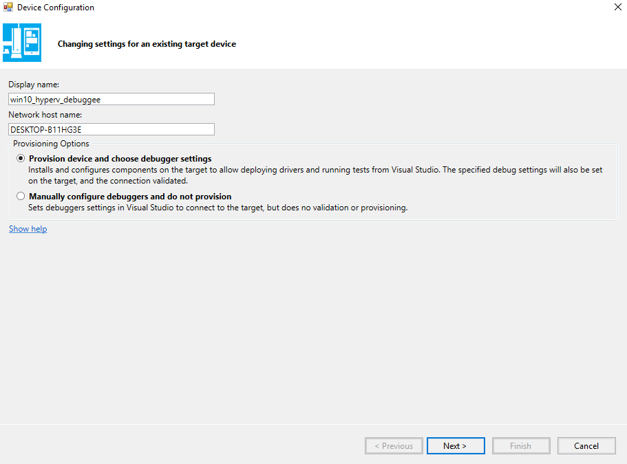
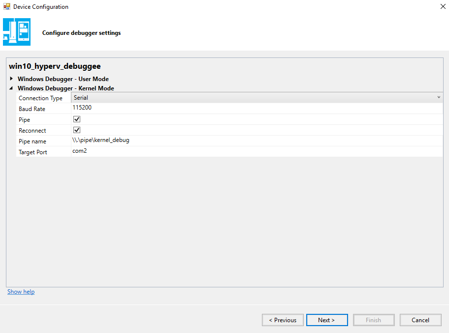
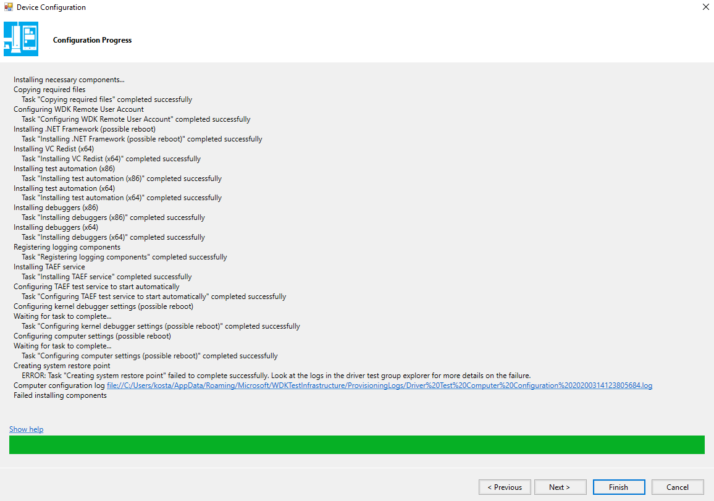
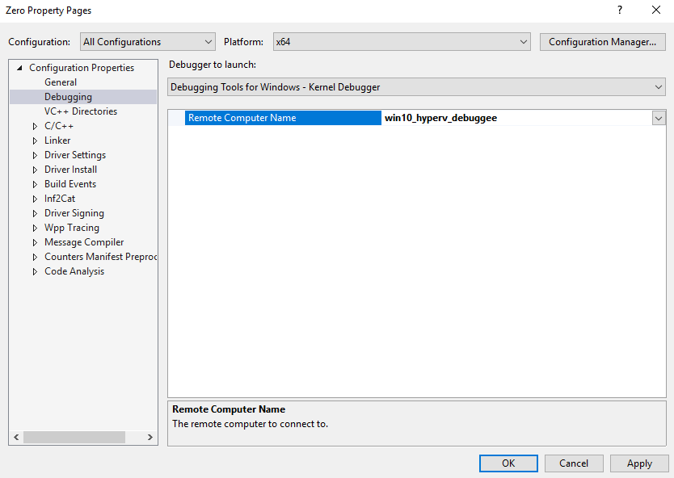
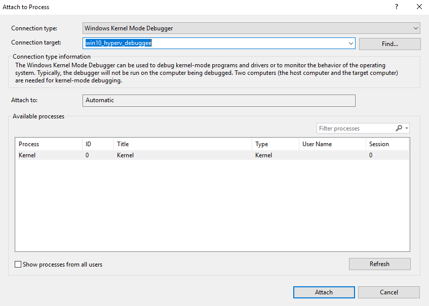

# windows-kernel-debugging-guide

## Setting up virtual machine

1. Enable kernel debugging
``` 
bcdedit /debug on

```
2. Set COM port
``` 
bcdedit /dbgsettings serial debugport:2 baudrate:115200
```

3. Turn off Firewall   

4. Install WDK Test Target. Can be copied from the following path on the host machine
```
C:\Program Files (x86)\Windows Kits\10\Remote\x64\WDK Test Target Setup x64-x64_en-us.msi
```
  
5. Set COM port for virtual machine



## Setting up visual studio debugger

### Config kernel debug device







### Set new device as remote debugged machine




## Start debugger session

1. Attach to remote kernel



2. Copy sys file of drivre to the virtual machine

3. Place break points in driver code

4. Start driver
```
sc create Zero type= kernel binPath= C:\Users\debuggee\Desktop\drivers\Zero.sys
```
5. Use additional service control commands to manage driver
```
sc start Zero
sc stop Zero
sc delete Zero
```
